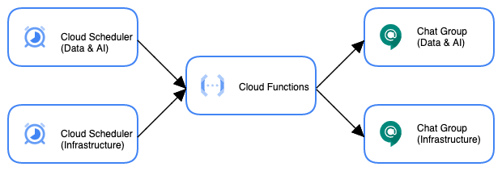

# Meeting bot

## Introdução
O projeto Meeting Bot começou com a necessidade da criação de alertas agendados, para avisar o início das dailies internas do time. Com isso foi criado um script em **Python** que recebe um payload de configuração, e chama a API do Google Chat para disparar uma mensagem em um determinado grupo.

## Arquitetura


Toda a arquitetura foi pensada para ser Cloud Native, e funcionar sempre sob-demanda para ter o mínimo de custo operacional e financeiro em cima do bot. Sempre tenha isso em mente para propor melhorias na arquitetura e deixar o bot ainda melhor.

O fluxo do alerta começa com um Cloud Scheduler contendo um payload de parâmetros e um cron configurado com a frequência do alerta. Esse scheduler vai ativar uma Cloud Functions (na frequência configurada), que contém o código em Python preparado para receber o payload de parâmetros e chamar a API do Google Chat para disparar a mensagem no grupo.

## Payload de configuração

Atualmente para criar um novo bot, basta subir um payload de configuração dentro da pasta `/assets`, conforme o exemplo abaixo:

```js
{
    "job_name": "data-daily-meeting-bot",
    "description": "This cloud scheduler is used to trigger a reminder for data daily.",
    "frequency": "0 11 * * mon,wed,fri",
    "time_zone": "America/Sao_Paulo",
    "meeting_url": "https://meet.google.com/xxx-xxxx-xxx",
    "webhook": "https://chat.googleapis.com/v1/spaces/space_id/messages?key=example_key"
}
```

Logo abaixo você pode encontrar a descrição de cada um dos campos necessários:

* `job_name`: Nome para o job do scheduler a ser criado.
* `description`: Descrição para o job do scheduler.
* `frequency`: String no formato de cronjob para configurar a frequência em que o job será disparado.
* `time_zone`: Timezone em que o job será baseado.
* `meeting_url`: URL que será inserida na mensagem de daily.
* `webhook`: Webhook que será utilizado para autenticar a chamada na API do Google Chat.

## Pipeline de CI/CD

O pipeline de CI/CD roda pelo Gitlab CI, e é nas configurações de variáveis do pipeline onde está armazenada a conta de serviço `gitlab-ci-meeting-bot@project_id.iam.gserviceaccount.com` utilizada pelo **Terraform** para provisionar a infraestrutura no GCP.